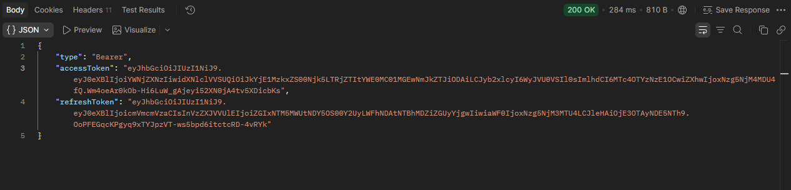
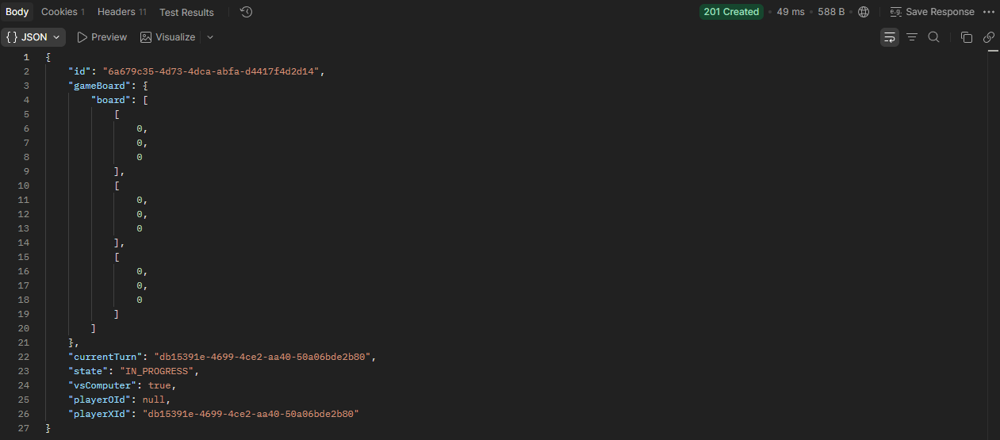
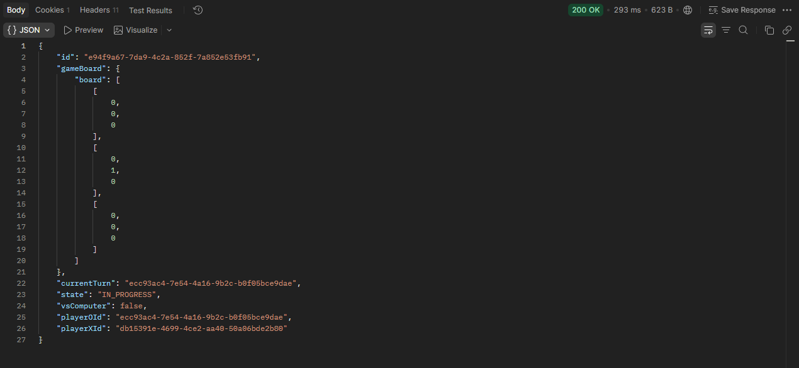
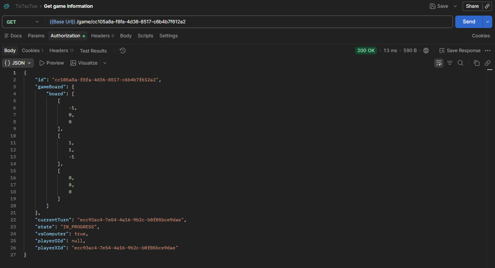
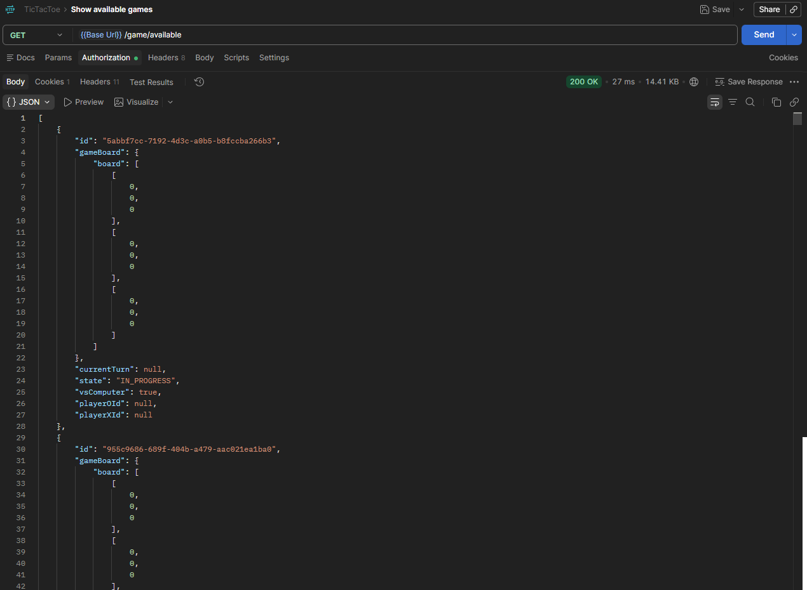
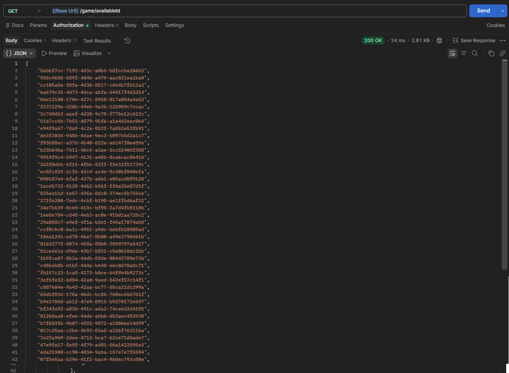
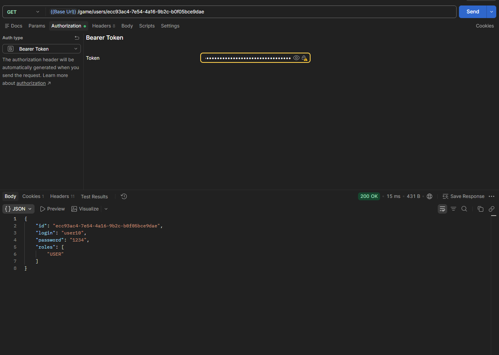
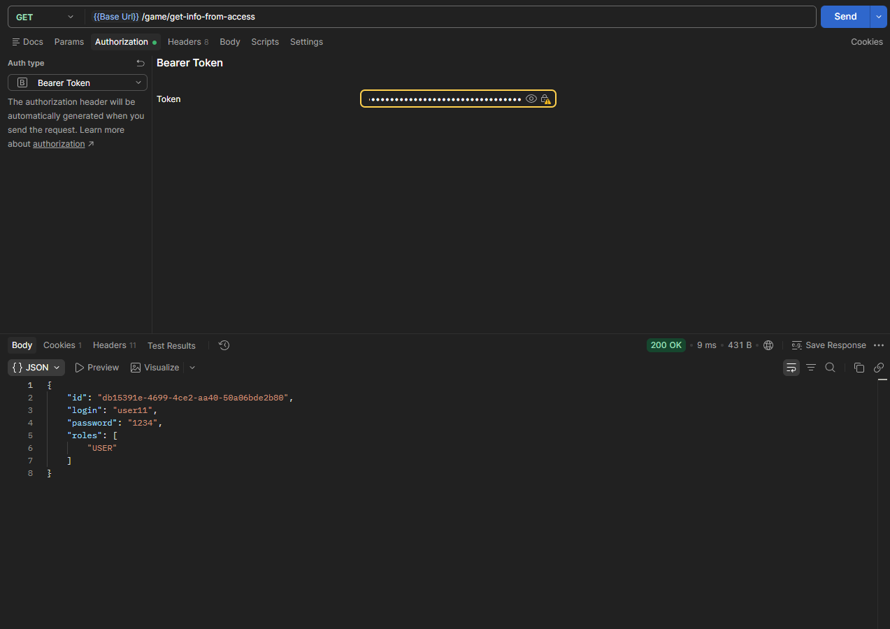
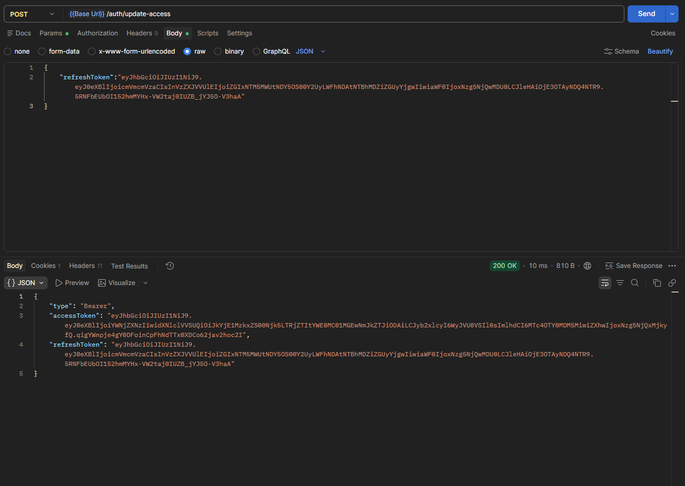

# TicTacToe
## О проекте:
REST API приложения для игры в крестики нолики на Java Spring/Boot. 
Поддерживает регистрацию пользователей, логин из базы данных PostgreSQL с использованием CRUD-repository, создание игр в 2-х режимах: Игра против ПК (используется алгоритм минимакс) или против другого игрока.
## Технологии:
- Java 18
- Spring Boot
- Spring Security
- PostgreSQL
- Gradle
## Как запустить:
Клонируем проект при помощи git clone
Переходим в папку TicTacToe
Используем ./gradlew build для сборки приложения
Далее ./gradlew bootRun для запуски приложения
## API endpoints:
### Регистрация

    POST http://localhost:8080/auth/register
    Header:
    Content-type: application/json
    Request:
    {
        "login":"<your_username>",
        "password":"<your_password>"
    }
    
### Логин

    GET http://localhost:8080/auth/login
    Header:
    Content-type: application/json
    Request:
    {
        "login":"<your_username>",
        "password":"<your_password>"
    }    
При выводе получаем 2 токена. Access Token и Refresh Token.
Пример вывода:

### Создание игры

    POST http://localhost:8080/game
    Request:
    Content-type: application/json
    {
        "mode":"<PC/Player>",
    }
    Authorization:
    Auth type = Bearer Token: <your_access_token>

Передаём полученный при логине access token в авторизацию и отправляем режим в котором хотим играть: PC/Player.
Пример вывода:

### Присоединение к игре

    POST http://localhost:8080/game/join/<game_UUID>
    Header:
    Content-type: application/json
    Authorization:
    Auth type = Bearer Token: <your_access_token>

Передаём полученный при логине access token в авторизацию и вводим ID игры в адресную строку после game/join/.
Работает ТОЛЬКО при выборе игры против игрока и ТОЛЬКО для второго игрока. Первый игрок подключается автоматически после создания игры.
Пример вывода при успешном подключении второго игрока:

[!Пример вывода](screenshots/JoinGameExample.png)

### Ход в игре

    POST http://localhost:8080/game/<game_UUID>
    Header:
    Content-type: application/json
    Request:
    {
        "row":"<значение от 0 до 2>",
        "column":<значение от 0 до 2>"
    }
    Authorization:
    Auth type = Bearer Token: <your_access_token>

Передаём значение куда хотим походить. Значения передаются от 0 до 2.
Так же в авторизацию передаётся accessToken игрока который должен совершить ход в данный момент.
Пример вывода:

### Получение информации об игре по её UUID

    GET http://localhost:8080/game/<game_UUID>
    Header:
    Content-type: application/json
    Authorization:
    Auth type = Bearer Token: <your_access_token>

В адресную строку вводим ID игры после /game/
Пример вывода:

### Вывод всех доступных для игры сессий

    GET http://localhost:8080/game/available
    Header:
    Content-type: application/json
    Authorization:
    Auth type = Bearer Token: <your_access_token>

Выводит список всех доступных игровых сессий (всех игр где нет победителя/ничьей).
Пример вывода:

### Вывод только UUID всех доступных для игры сессий

    GET http://localhost:8080/game/availableId
    Header:
    Content-type: application/json
    Authorization:
    Auth type = Bearer Token: <your_access_token>

Выводит только ID всех доступных игровых сессий.
Пример вывода:

### Вывод информации (логин, пароль) игрока по UUID

    GET http://localhost:8080/game/users/<user_id>
    Header:
    Content-type: application/json
    Authorization:
    Auth type = Bearer Token: <your_access_token>

Вводим ID игрока в адресную строку после game/users/
Выводит всю доступную информацию об игроке.
Пример вывода:

### Вывод информации игрока по Access Token

    GET http://localhost:8080/game/get-info-from-access
    Header:
    Conent-type: application/json
    Authorization:
    Auth type = Bearer Token: <your_access_token>

Выводит всю доступную информацию об игроке по его access token.
Пример вывода:

### Обновление access token 

    POST http://localhost:8080/auth/update-access
    Header:
    Content-type: application/json
    Request:
    {
        "refreshToken":"<your_refresh_token>"    
    }

Вводим полученный при логие/регистрации refresh token и получаем новый access token.
Пример вывода:

